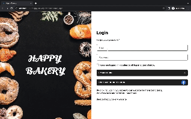

# Welcome to Happy Bakery!




## 功能

前台
1. 可以註冊會員、登入後開始購物
2. 可以瀏覽全部商品、最新商品、依商品分類顯示產品；並且有排序功能下拉式選單，可以依價錢或上架日期排序商品
3. 可以點選navbar的放大鏡icon輸入關鍵字搜尋產品，依照關鍵字顯示產品頁面
4. 商品詳細頁面可以瀏覽商品照片與商品介紹，選擇商品數量後加入購物車或者立即購買直接導入結帳頁面
5. 加入購物車後可以從右上角的數字看到購物車內商品數量，點擊後可以觀看購物車內容
6. 點選checkout導入購物車頁面，可以在此做購物車商品的編輯：修改數量或刪除
7. 輸入完整送貨資料與付款資料後，可以navbar上的user icon到member center觀看過往的訂單資料
8. 可以在member center的member info裡修改會員資料和密碼

後台
1. 只有admin帳號可以登入
2. 可以觀看所有產品或分類顯示產品
3. 點選產品可以看到產品資料並修改
4. 可以新增產品、上傳產品照片至多4張
5. 預設可以看到7天前至今天的訂單，點選右上角日期可以修改日期區間，瀏覽不同時間的訂單
6. 點選訂單表格表頭可以做篩選或排序
7. 點選訂單check icon可以觀看訂單詳細資料，並做訂單編輯：修改狀態或撰寫備註
8. dashboard優化中..尚未完成

## 使用方法

<!-- ### 線上運行 (推薦)

Github Page: https://liam67726978.github.io/simple-twitter/ -->

### 本地運行

1. 請先至 https://github.com/Jasmineeds/ecommerce-bakery 運行伺服器在localhost:3000

2. 在本地開啟 Terminal 輸入以下指令

```bash
  git clone https://github.com/Yoruyeh/happy-bakery-website.git
```

3. 進入 Clone 下來的專案目錄

```bash
  cd happy-bakery-website
```

4. 執行 npm install

```bash
  npm install
```

5. 執行 npm run start

```bash
  npm run start
```

6. Terminal詢問以下問題後輸入Y

```bash
  Would you like to run the app on another port instead
```

5. 打開瀏覽器，在 URL 地址欄輸入

```bash
  http://localhost:3001/happy-bakery-website
```
